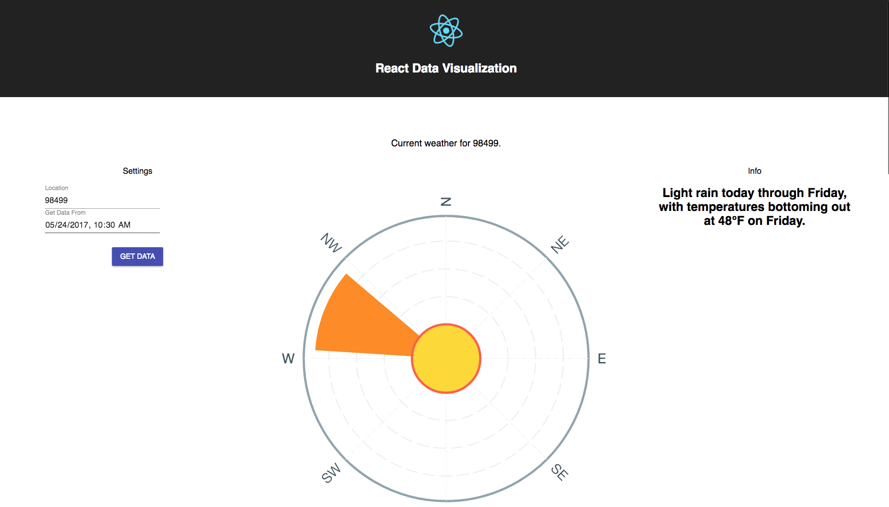
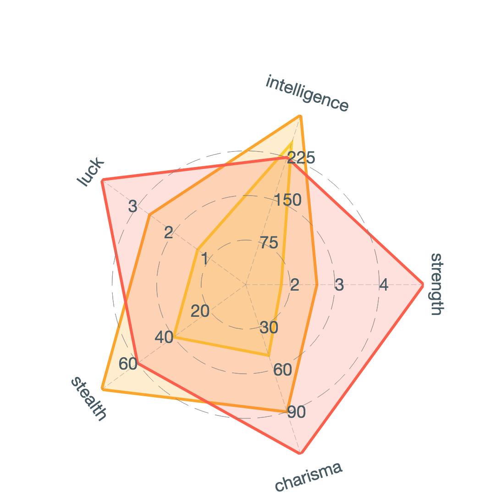

# This project is aimed to showcase React and Data Visualization

## `npm install`

## `npm run start`

## In a different terminal

## `~./cd server`

## `npm install`

## `npm run start`

## If no map is rendering!

* First make sure you have a valid mapbox key setup in your .env file then proceed below.

* Go here and see if web gl is supported
  http://mapbox.github.io/mapbox-gl-supported
* If it is supported, and you're using chrome, do this...

* Navigate to chrome://flags/
* Enable 'Override software rendering list'

## .env config

* You need to make a .env file and place it inside the root of the server folder
* It should look like this

  * DARKSKY_SECRET_KEY='darkSkySecretKeyHere'

* You also need to make a .env file and place it at the root of this project folder
* It should look like this

  * REACT_APP_MAP_BOX_TOKEN='mapBoxTokenKeyHere'

### Firebase hosting

* Firebase hosting url = https://reactdatavisualization.firebaseapp.com

* Firebase functions api server proxy = https://us-central1-reactdatavisualization.cloudfunctions.net/api3
* A GET to https://us-central1-reactdatavisualization.cloudfunctions.net/api3/test Should return

  * "Hello from Express on Firebase with CORS! No trailing '/' required!"
